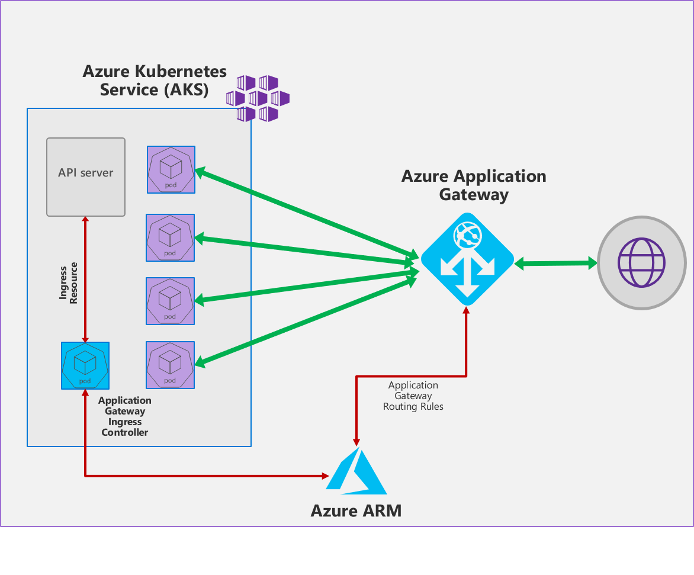

# terraform-azurerm-appgw-ingress

The Application Gateway Ingress Controller allows the [Azure Application Gateway](https://azure.microsoft.com/en-us/services/application-gateway/) to be used as the ingress for an [Azure Kubernetes Service](https://azure.microsoft.com/en-us/services/kubernetes-service/) aka AKS cluster.

As shown in the figure below, the ingress controller runs as a pod within the AKS cluster. It consumes [Kubernetes Ingress Resources](https://kubernetes.io/docs/concepts/services-networking/ingress/) and converts them to an Azure Application Gateway configuration which allows the gateway to load-balance traffic to Kubernetes pods.

**This module helps in deploying the necessary resources for AKS cluster with Application Gateway as ingress controller.**



## Usage

```hcl
resource "azurerm_resource_group" "rg1" {
  name     = "testResourceGroup1"
  location = "francecentral"

  tags {
    environment = "dev"
    client      = "scalair"
  }
}

module "appgw-ingress-k8s-cluster" {
  source                              = "github.com/scalair/terraform-azurerm-appgw-ingress-k8s-cluster"
  version                             = "0.1.0"
  resource_group_name                 = azurerm_resource_group.rg1.name
  location                            = "francecentral"
  aks_service_principal_app_id        = "<App ID of the service principal>"
  aks_service_principal_client_secret = "<Client secret of the service principal>"
  aks_service_principal_object_id     = "<Object ID of the service principal>"

  tags = {
    environment = "dev"
    client      = "scalair"
  }
}
```

**Take a look at ```variables.tf``` file to know implemented variables**

## Authors

Created by [Scalair](http://github.com/scalair)
